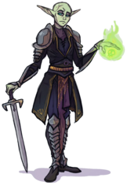

```{r include = FALSE}
knitr::opts_chunk$set(echo = FALSE)
library(dplyr)
library(knitr)
library(kableExtra)
```

# Preface

This is the journal of Vernon Vickies, a Verdan Warlock extraordinaire.

<a href = "media/vernon.png" target="_blank"></a> 


```{r echo=FALSE}
files <- system("ls journal_entries", intern = TRUE)

journal <- lapply(sprintf("journal_entries/%s", files), readr::read_file) %>% 
  paste(collapse = "\n")
```

This journal is private and you shouldn't be reading it. Shame on you. 

But since you're here, a few warnings:

1. Vernon isn't great at spelling, espeically when it comes to names of people, places, and races. He's more of a talker than a writer.
2. Vernon doesn't always write in his journal at regular intervals, sometimes there is a large span of time between entries. This can result in brief descriptions of seemingly important events and long winded descriptions of frivolity. He simply can't remember the details for very long so the amount of attention an event is given in his journal is more related to how soon after he wrote about it than of how important it was.
3. As I said, this is a private journal so you shouldn't be reading it anyway. Therefore, no complaining about points 1 and 2.

`r journal`